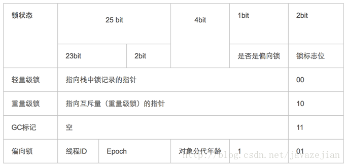
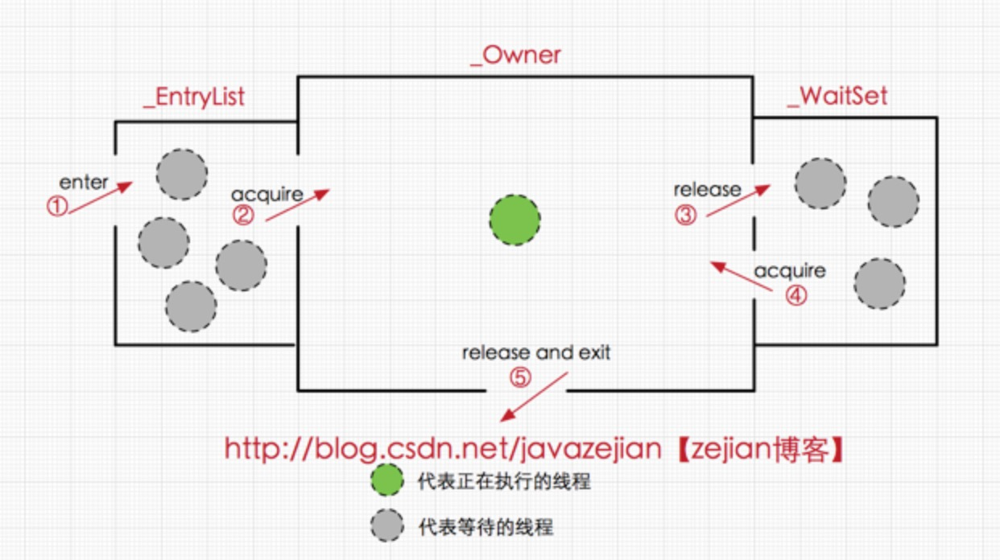

# Java笔记

# 一、Java基础
### 1.字符串(String、StringBuilder、StringBuffer)
- **String**：内部使用final char value[]存储，由于使用final关键字修饰，对象初始化后不能修改，属于定长字符串。
- **StringBuilder**：内部使用char value[]存储，非线程安全，可使用append动态添加字符串，能够动态扩容。JDK9开始使用byte value[]存储。
- **StringBuffer**：内部使用char value[]存储，线程安全，可使用append动态添加字符串，能够动态扩容。JDK9开始使用byte value[]存储。
    
### 2.集合(Set、List)
    List和Set都继承Collection接口。
         1.可以允许重复的对象。
         2.可以插入多个null元素。
         3.是一个有序容器，保持了每个元素的插入顺序，输出的顺序就是插入的顺序。
         4.常用的实现类有 ArrayList、LinkedList 和 Vector。ArrayList 最为流行，它提供了使用索引的随意访问，而 LinkedList
         则对于经常需要从 List 中添加或删除元素的场合更为合适。
            
    Set: 1.不允许重复对象
    　　  2.无序容器，你无法保证每个元素的存储顺序，TreeSet通过 Comparator  或者 Comparable 维护了一个排序顺序。
         3.只允许一个 null 元素
         4.Set 接口最流行的几个实现类是 HashSet、LinkedHashSet 以及 TreeSet。最流行的是基于 HashMap 实现的 HashSet；
         TreeSet 还实现了 SortedSet 接口，因此 TreeSet 是一个根据其 compare() 和 compareTo() 的定义进行排序的有序容器。        
    
### 3.Map(HashMap、LinkedHashMap、TreeMap、Hashtable、ConcurrentHashMap)
    非线程安全：HashMap、LinkedHashMap、TreeMap
    线程安全：Hashtable、ConcurrentHashMap
    
    HashMap、有序集合LinkedHashMap、TreeMap都属于非线程安全，三者的区别：
    https://www.cnblogs.com/acm-bingzi/p/javaMap.html

    COnHasMap（ConcurrentHashMap）这个必问的
    ConcurrentHashMap原理分析：https://www.cnblogs.com/ITtangtang/p/3948786.html

    hash原理：https://www.cnblogs.com/chengxiao/p/6059914.html
    Map本质就是数组（物理存储结构），HashMap即是采用了链地址法，也就是数组+链表的方式

    Hashtable：继承Dictionary类，是遗留类，很多映射的常用功能与HashMap类似，线程安全，但是不建议在新代码使用，不需要线程安
    全的场合可以用HashMap替换，需要线程安全的场合可以用ConcurrentHashMap替换。
    LinkedHashMap：是HashMap的一个子类，保存了记录的插入顺序，在用Iterator遍历LinkedHashMap时，先得到的记录肯定是先插入
    的，也可以在构造时带参数，按照访问次序排序。

    TreeMap：继承AbstractMap,实现SortedMap接口，能够把它保存的记录根据键排序，默认是按键值的升序排序，也可以指定排序的比
    较器，当用Iterator遍历TreeMap时，得到的记录是排过序的。如果使用排序的映射，建议使用TreeMap。在使用TreeMap时，key必须
    实现Comparable接口或者在构造TreeMap传入自定义的Comparator，否则会在运行时抛出java.lang.ClassCastException类型的
    异常。哈希表（hash table）也叫散列表，是一种非常重要的数据结构，应用场景及其丰富，许多缓存技术（比如memcached）的核心其
    实就是在内存中维护一张大的哈希表，而HashMap的实现原理也常常出现在各类的面试题中，重要性可见一斑。
    
### 4.Java反射
    主要是指程序可以访问、检测和修改它本身状态或行为的一种能力，并能根据自身行为的状态和结果，调整或修改应用所描述行为的状态和
    相关的语义。反射是java中一种强大的工具，能够使我们很方便的创建灵活的代码，这些代码可以再运行时装配，无需在组件之间进行源代
    码链接。但是反射使用不当会成本很高！
    反射的实现主要借助以下四个类：
    Class：类的对象
    Constructor：类的构造方法
    Field：类中的属性对象
    Method：类中的方法对象

### 5.Java注解
- 按运行机制（注解存在于程序的那个阶段）将注解分为三类：源码注解(只在源码存在)、编译注解(在class文件中也存在)、运行时注解(在运行阶段仍然起作用)。
- JDK自带的注解（Java目前只内置了三种标准注解：@Override、@Deprecated、@SuppressWarnings，以及四种元注解：@Target、@Retention、@Documented、@Inherited）。
  - **三种标准注解功能说明**：  
      @Override：表示当前的方法定义将覆盖超类中的方法。  
      @Deprecated：使用了注解为它的元素编译器将发出警告，因为注解@Deprecated是不赞成使用的代码，被弃用的代码。  
      @SuppressWarnings：关闭不当编译器警告信息。
  - **四种元注解功能说明**：  
      **@Target**：表示该注解可以用于什么地方，可能的ElementType参数有：
      
        1. CONSTRUCTOR     ：构造器的声明
        2. FIELD           ：域声明（包括enum实例）
        3. LOCAL_VARIABLE  ：局部变量声明
        4. METHOD          ：方法声明
        5. PACKAGE         ：包声明
        6. PARAMETER       ：参数声明
        7. ANNOTATION_TYPE ：注解类型声明
        8. TYPE_PARAMETER  ：类型参数声明，泛型类型定义使用（1.8新增）
        9. TYPE_USE        ：类型使用声明，变量定义，可以是局部变量（1.8新增）
        10. TYPE           ：类、接口（包括注解类型）或enum声明
       
      **@Retention**：表示需要在什么级别保存该注解信息。可选的RetentionPolicy参数包括：  
       
        1. SOURCE          ：注解将被编译器丢弃
        2. CLASS           ：注解在class文件中可用，但会被VM丢弃
        3. RUNTIME         ：VM将在运行期间保留注解，因此可以通过反射机制读取注解的信息。
       
      **@Document**：将注解包含在Javadoc中  
      **@Inherited**：允许子类继承父类中的注解

### 6.Java泛型
- Java在泛型设计上是一种“伪泛型”，存在着[泛型擦除](https://www.cnblogs.com/doucheyard/p/6855823.html)。
- 泛型实参只会在类、字段及方法参数内保存其签名，无法通过反射动态获取泛型实例的具体实参。
- 获取泛型实参三种方法：1、通过传递实参类型；2、明确定义泛型实参类型，通过反射获取签名；3、通过匿名类捕获相关的泛型实参。
    
    - 泛型继承，通配符，泛型反射：https://blog.csdn.net/vi_young_95/article/details/82979358
    
### 7.JDBC
- JDBC（Java DataBase Connectivity，Java数据库连接）是一种用于执行SQL语句的Java API，可以为多种关系数据库提供统一访问，它由一组用Java语言编写的类和接口组成。JDBC提供了一种基准，据此可以构建更高级的工具和接口，使数据库开发人员能够编写数据库应用程序。
```java
import java.sql.*;
public class DriverTest{
    public static void main(String[] args)throws Exception{
        //注册驱动
        Class.forName("com.mysql.jdbc.Driver");
        String url = "jdbc:mysql://localhost:3306/test";
        //创建连接
        Connection conn = DriverManager.getConnection(url,"root","password");
        //创建SQL语句
        String sql = "INSERT INTO test(name,sex,age)VALUES(?,?,?)";
        PreparedStatement pstmt = conn.prepareStatement(sql);
        //设置参数
        pstmt.setString(1,"张某某");
        pstmt.setString(2,"男");
        pstmt.setInt(3,20);
        //执行SQL语句
        int num = pstmt.executeUpdate();
        System.out.println("row num : "+num);
        //关闭PreparedStatement
        pstmt.close();
        //关闭连接
        conn.close();
    }
}
```

### 8.JNI
- JNI(Java Native Interface)意为Java本地调用，它允许Java代码和其他语言写的代码进行交互，简单的说，一种在Java虚拟机控制下执行代码的标准机制。
- JNI函数表的组成就像C++的虚函数表，虚拟机可以运行多张函数表。
- JNI接口指针仅在当前线程中起作用，指针不能从一个线程进入另一个线程，但可以在不同的线程中调用本地方法。

### 9.深拷贝与浅拷贝
- **浅拷贝**：是指在拷贝对象时，对于基本数据类型的变量会重新复制一份，而对于引用类型的变量只是对引用进行拷贝，没有对引用指向的对象进行拷贝。 
- **深拷贝**：是指在拷贝对象时，同时会对引用指向的对象进行拷贝。区别就在于是否对对象中的引用变量所指向的对象进行拷贝。浅拷贝是指拷贝对象时仅仅拷贝对象本身（包括对象中的基本变量），而不拷贝对象包含的引用指向的对象。深拷贝不仅拷贝对象本身，而且拷贝对象包含的引用指向的所有对象。
  >举例：对象A1中包含对B1的引用，B1中包含对C1的引用。浅拷贝A1得到A2，A2中依然包含对B1的引用，B1中依然包含对C1的引用。深拷贝则是对浅拷贝的递归，深拷贝A1得到A2，A2中包含对B2（B1的copy）的引用，B2中包含对C2（C1的copy）的引用。若不对clone()方法进行改写，则调用此方法得到的对象即为浅拷贝。
 
### 10、Java代理
- 代理(Proxy)是一种设计模式，提供了对目标对象另外的访问方式；即通过代理对象访问目标对象。这样做的好处是：可以在目标对象实现的基础上，增强额外的功能操作，即扩展目标对象的功能。
- Java有三种代理方式：静态代理、动态代理、CGlib代理。
  1. 静态代理
  2. 动态代理
  3. CGlib代理

    这里使用到编程中的一个思想:不要随意去修改别人已经写好的代码或者方法,如果需改修改,可以通过代理的方式来扩展该方法
    https://www.cnblogs.com/cenyu/p/6289209.html

### 11、transient volatile
    transient相关：
    volatile相关：https://www.cnblogs.com/dolphin0520/p/3920373.html
    volatile：保证了不同线程对这个变量进行操作时的可见性，即一个线程修改了某个变量的值，这新值对其他线程来说是立即可见的。
     禁止进行指令重排序。

### 12、Java类加载
- 类加载器实现的功能是即为加载阶段获取二进制字节流的时候，JDK使用双亲委派方式来确保加载的类在JVM中全局唯一。
- JVM提供了以下3种系统的类加载器：
  1. 启动类加载器（Bootstrap ClassLoader）：最顶层的类加载器，负责加载 JAVA_HOME\lib 目录中的，或通过-Xbootclasspath参数指定路径中的，且被虚拟机认可（按文件名识别，如rt.jar）的类。
  2. 扩展类加载器(Extension ClassLoader)：负责加载 JAVA_HOME\lib\ext 目录中的，或通过java.ext.dirs系统变量指定路径中的类库。
  3. 应用程序类加载器(Application ClassLoader)：也叫做系统类加载器，可以通过getSystemClassLoader()获取，负责加载用户路径（classpath）上的类库。如果没有自定义类加载器，一般这个就是默认的类加载器。
   
# 二、设计模式
    java的设计模式大体上分为三大类：
    创建型模式（5种）：工厂方法模式，抽象工厂模式，单例模式，建造者模式，原型模式。
    结构型模式（7种）：适配器模式，装饰器模式，代理模式，外观模式，桥接模式，组合模式，享元模式。
    行为型模式（11种）：策略模式、模板方法模式、观察者模式、迭代子模式、责任链模式、命令模式、备忘录模式、状态模式、
    访问者模式、中介者模式、解释器模式。
    设计模式遵循的原则有6个：
    1、开闭原则（Open Close Principle）
    　　对扩展开放，对修改关闭。
    2、里氏代换原则（Liskov Substitution Principle）
    　　只有当衍生类可以替换掉基类，软件单位的功能不受到影响时，基类才能真正被复用，而衍生类也能够在基类的基础上增加新的行为。
    3、依赖倒转原则（Dependence Inversion Principle）
    　　这个是开闭原则的基础，对接口编程，依赖于抽象而不依赖于具体。
    4、接口隔离原则（Interface Segregation Principle）
    　　使用多个隔离的借口来降低耦合度。
    5、迪米特法则（最少知道原则）（Demeter Principle）
    　　一个实体应当尽量少的与其他实体之间发生相互作用，使得系统功能模块相对独立。
    6、合成复用原则（Composite Reuse Principle）
    　　原则是尽量使用合成/聚合的方式，而不是使用继承。继承实际上破坏了类的封装性，超类的方法可能会被子类修改。
    
### 1.工厂方法模式
### 2.抽象工厂模式
### 3.单例模式
~~### 4.建造者模式~~
~~### 5.原型模式~~
### 6.适配器模式
~~### 7.装饰器模式~~
### 8.代理模式
### 9.外观模式
~~### 10.桥接模式~~
~~### 11.组合模式~~
~~### 12.享元模式~~
### 13.策略模式
~~### 14.模板方法模式~~
### 15.观察者模式
~~### 16.迭代子模式~~
~~### 17.责任链模式~~
### 18.命令模式
~~### 19.备忘录模式~~
### 20.状态模式
### 21.访问者模式
~~### 22.中介者模式~~
### 23.解释器模式
    基础的了解 观察者 工厂 啥的就行了，没必要太多。

# 三、多线程
- 线程的生命周期及五种基本状态
关于Java中线程的生命周期，首先看一下下面这张较为经典的图：


       Java线程具有五中基本状态
       
       新建状态（New）：当线程对象对创建后，即进入了新建状态，如：Thread t = new MyThread();
       
       就绪状态（Runnable）：当调用线程对象的start()方法（t.start();），线程即进入就绪状态。处于就绪状态的线程，只是说明此线程已经做好了准备，随时等待CPU调度执行，并不是说执行了t.start()此线程立即就会执行；
       
       运行状态（Running）：当CPU开始调度处于就绪状态的线程时，此时线程才得以真正执行，即进入到运行状态。注：就     绪状态是进入到运行状态的唯一入口，也就是说，线程要想进入运行状态执行，首先必须处于就绪状态中；
       
       阻塞状态（Blocked）：处于运行状态中的线程由于某种原因，暂时放弃对CPU的使用权，停止执行，此时进入阻塞状态，直到其进入到就绪状态，才 有机会再次被CPU调用以进入到运行状态。根据阻塞产生的原因不同，阻塞状态又可以分为三种：
       
       1.等待阻塞：运行状态中的线程执行wait()方法，使本线程进入到等待阻塞状态；
       
       2.同步阻塞 -- 线程在获取synchronized同步锁失败(因为锁被其它线程所占用)，它会进入同步阻塞状态；
       
       3.其他阻塞 -- 通过调用线程的sleep()或join()或发出了I/O请求时，线程会进入到阻塞状态。当sleep()状态超时、join()等待线程终止或者超时、或者I/O处理完毕时，线程重新转入就绪状态。
       
       死亡状态（Dead）：线程执行完了或者因异常退出了run()方法，该线程结束生命周期。

### 1.Synchronization关键字底层原理
Java虚拟机中的同步(Synchronization)基于进入和退出管程(Monitor)对象实现，无论是显式同步(有明确的monitorenter和monitorexit指令，即同步代码块)还是隐式同步都是如此。在Java语言中，同步用的最多的地方可能是被synchronized修饰的同步方法。同步方法并不是由monitorenter和monitorexit指令来实现同步的，而是由方法调用指令读取运行时常量池中方法的ACC_SYNCHRONIZED标志来隐式实现的。在JVM中，对象在内存中的布局分为三块区域：对象头、实例数据和对齐填充。  


- 实例变量：存放类的属性数据信息，包括父类的属性信息，如果是数组的实例部分还包括数组的长度，这部分内存按4字节对齐。
- 填充数据：由于虚拟机要求对象起始地址必须是8字节的整数倍。填充数据不是必须存在的，仅仅是为了字节对齐。
- 对象头：它是实现synchronized的锁对象的基础，一般而言，synchronized使用的锁对象是存储在Java对象头里的，JVM中采用2个字来存储对象头(如果对象是数组则会分配3个字，多出来的1个字记录的是数组长度)，其主要结构是由Mark Word和Class Metadata Address组成，其结构说明如下：

| 虚拟机位数 | 头对象结构 | 说明 |
| --- |--- | --- |
| 32/64bit | Mark Word               | 存储对象的hashCode、锁信息或分代年龄或GC标志等信息 |
| 32/64bit | Class Metadata Address  | 类型指针指向对象的类元数据，JVM通过这个指针确定该对象是哪个类的实例 |

其中Mark Word在默认情况下存储着对象的HashCode、分代年龄、锁标记位等以下是32位JVM的Mark Word默认存储结构。

| 锁状态 | 25bit | 4bit | 1bit是否是偏向锁 | 2bit | 锁标志位 |
| --- | --- | ---| ---| ---| ---|
| 无锁状态 | 对象HashCode | 对象分代年龄| 0 | 01 |

由于对象头的信息是与对象自身定义的数据没有关系的额外存储成本，因此考虑到JVM的空间效率，Mark Word 被设计成为一个非固定的数据结构，以便存储更多有效的数据，它会根据对象本身的状态复用自己的存储空间，如32位JVM下，除了上述列出的Mark Word默认存储结构外，还有如下可能变化的结构：


```c++
ObjectMonitor() {
    _header       = NULL;
    _count        = 0; //记录个数
    _waiters      = 0,
    _recursions   = 0;
    _object       = NULL;
    _owner        = NULL;
    _WaitSet      = NULL; //处于wait状态的线程，会被加入到_WaitSet
    _WaitSetLock  = 0 ;
    _Responsible  = NULL ;
    _succ         = NULL ;
    _cxq          = NULL ;
    FreeNext      = NULL ;
    _EntryList    = NULL ; //处于等待锁block状态的线程，会被加入到该列表
    _SpinFreq     = 0 ;
    _SpinClock    = 0 ;
    OwnerIsThread = 0 ;
  }
```

ObjectMonitor中有两个队列，_WaitSet和_EntryList，用来保存ObjectWaiter对象列表(每个等待锁的线程都会被封装成ObjectWaiter对象)，_owner指向持有ObjectMonitor对象的线程，当多个线程同时访问一段同步代码时，首先会进入_EntryList集合，当线程获取到对象的monitor后进入_Owner区域并把monitor中的owner变量设置为当前线程同时monitor中的计数器count加1，若线程调用wait()方法，将释放当前持有的monitor，owner变量恢复为null，count自减1，同时该线程进入WaitSet集合中等待被唤醒。若当前线程执行完毕也将释放monitor(锁)并复位变量的值，以便其他线程进入获取monitor(锁)。如下图：


由此看来，monitor对象存在于每个Java对象的对象头中(存储的指针的指向)，synchronized锁便是通过这种方式获取锁的，也是为什么Java中任意对象可以作为锁的原因，**同时也是notify/notifyAll/wait等方法存在于顶级对象Object中的原因**。
[原文连接](https://blog.csdn.net/javazejian/article/details/72828483)

### 2.
### 3.锁
    同步锁
    分段锁
    JAVA中锁的对比：https://www.cnblogs.com/zhimingyang/p/5702752.html
    乐观锁、悲观锁：https://blog.csdn.net/qq_34337272/article/details/81072874
    公平锁、非公平锁
    创建一个线程的方式：Thread、Runnable、Callable
    
    在并发编程中，我们通常会遇到以下三个问题：原子性问题，可见性问题，有序性问题。

### 4.线程池实现原理

# 四、网络篇
### 1.TCP协议的三次握手
### 2.
### 3.

# 五、JDK
### 1.JDK源码
### 2.JDK5新特性
    java注解在java1.5版本引入。
    
### 3.JDK6新特性

### 4.JDK7新特性

### 5.JDK8新特性
    hashMap增加红黑树：https://blog.csdn.net/lch_2016/article/details/81045480
    新功能：http://ifeve.com/java-8-features-tutorial/
### 6.JDK9新特性
    https://baijiahao.baidu.com/s?id=1593429162250494010&wfr=spider&for=pc

# 六、JVM
    1、程序计数器是一块较小的内存空间，用于记录Java中的每个线程当前执行的指令，各个线程相互独立；这也是唯一一个在Java虚拟机规范中
    没有规定任何OutOfMemoryError（内存溢出）情况的区域。
    2、Java虚拟机栈和程序计数器一样也是线程私有的，用于描述Java方法执行的内存模型（每个方法执行时都会创建一个栈帧），用于存储局部
    变量、操作数栈、动态链接、方法出口等。
    3、当线程请求的栈深度大于虚拟机所允许的深度时，则会抛出StackOverflowError异常。如果虚拟机栈动态扩展时无法申请到足够的内存，
    则会抛出OutOfMemoryError异常。
    4、本地方法栈与虚拟机栈的作用非常相似，它们的区别在于Java虚拟机栈为虚拟机执行Java方法（也就是字节码）服务，本地方法栈则为虚拟
    机使用Native方法服务。本地方法栈也会抛出StackOverflowError和OutOfMemoryError异常。
    5、Java堆（Java Heap），Java堆是虚拟机所有管理的内存中最大的一块，也是被所有线程共享的一块内存区域，是在虚拟机启动时创建，
    此内存的唯一目的是存放对象实例。
    6、Java堆是垃圾收集器管理的主要区域，因此也被称做“GC堆”（Garbage Collected Heap）；Java中的GC一般都是使用分代收集算法；
    根据Java虚拟机规范规定，Java堆可以处于物理上不连续的内存空间中，只要逻辑上是连续的即可。
    7、方法区（Method Area）与Java堆一样，是各个线程共享的内存区域，用于存储已经被虚拟机加载的类信息、常量、静态变量、即时编译
    器编译后的代码。

---    
    
    1、Java堆是垃圾收集器管理的主要区域，因此也被称做“GC堆”（Garbage Collected Heap）。Java中的GC一般都是使用分代收集算法。
    2、根据Java虚拟机规范规定，Java堆可以处于物理上不连续的内存空间中，只要逻辑上是连续的即可。
    3、运行时常量池（Runtime Constant Pool）是方法区的一部分，可以使用String的一个本地方法把字符串添加到常量池中（public 
    native String intern()）。从JDK7开始，字符串常量和符号引用等就被移出永久代：符号引用迁移至系统堆内存（Native Heap）；
    字符串字面量移至Java堆（Java Heap）。
    4、直接内存（Direct Memory），直接内存的分配不会受到Java堆大小的限制。
    5、对象存活判断：引用计数：对象新增一个引用，计数增加1；可达性分析：从GC Roots开始向下搜索，经历的链路成为引用链，没有被引
    用链关联的引用则为不可用对象（Hotspot默认方式）。
    6、共享类数据（CDS）是Hotspot JVM 5.0 的时候引入的新特性。在 JVM 安装过程中，安装进程会加载一系列核心 JVM 类（比如
    rt.jar）到一个共享的内存映射区域。CDS 减少了加载这些类需要的时间，提高了 JVM 启动的速度，允许这些类被不同的 JVM 实例共
    享，同时也减少了内存消耗。
    7、ClassLoader加载也是属于JDK的一个安全机制，用于防止用户编写的程序覆盖Java SE包中的内容（采用双亲委派机制实现）。JDK
    只会保证程序的安全性，但不会保证文件的安全性（手动更改rt.jar中的class）。
    8、HotSpot虚拟机可以配置为以下运行模式（通过java -version就可以查看虚拟机的运行模式）:
        -Xint：解释模式
        -Xcomp：编译模式
        -Xmixed：混合模式
    9、JVM启动时添加-verbose:class参数，在项目启动时会把项目所加的jar包都打印出来。
    
---    
    java -Dio.netty.leakDetectionLevel=advanced 
    -Djava.net.preferIPv4Stack=true 
    -Dsun.net.inetaddr.ttl=30 
    -Xms1024m -Xmx5120m  
    -XX:+UseParallelGC -XX:ParallelGCThreads=4 
    -XX:+UseParallelOldGC -XX:+UseAdaptiveSizePolicy 
    -XX:ErrorFile=${LOGDIR}/hs_err_%p.log -XX:-OmitStackTraceInFastThrow 
    -XX:+HeapDumpOnOutOfMemoryError -XX:HeapDumpPath=${LOGDIR}/ -jar $path  
    -Dspring.config.location=application.properties
    
### 1.OOM
    -XX:+HeapDumpOnOutOfMemoryError
    该配置会把快照保存在用户目录或者tomcat目录下，也可以通过 -XX:HeapDumpPath=/tmp/heapdump.hprof 来显示指定路径
    
    此外，OnOutOfMemoryError参数允许用户指定当出现oom时，指定某个脚本来完成一些动作。
    -XX:+HeapDumpOnOutOfMemoryError -XX:HeapDumpPath=/tmp/heapdump.hprof -XX:OnOutOfMemoryError="sh ~/test.sh"
    https://blog.csdn.net/xiaoliuliu2050/article/details/51226282
    https://blog.csdn.net/gaochao1995/article/details/38660241
    jmap

### 2.GC管理
- GC主要是对堆内存进行回收，现在收集器基本都是采用的分代收集算法，所以Java堆中还可以细分为新生代和老年代。

**jstat**：JDK自带的一个轻量级监控工具。[更多](https://www.jianshu.com/p/213710fb9e40)  
- option配置如下：
   
      -class              ：显示ClassLoad的相关信息；
      -compiler           ：显示JIT编译的相关信息；
      -gc                 ：显示和GC相关的堆信息；
      -gccapacity         ：显示各个代的容量以及使用情况；
      -gcmetacapacity     ：显示metaspace的大小；
      -gcnew              ：显示新生代信息；
      -gcnewcapacity      ：显示新生代大小和使用情况；
      -gcold              ：显示老年代和永久代的信息；
      -gcoldcapacity      ：显示老年代的大小；
      -gcutil             ：显示垃圾收集信息；
      -gccause            ：显示垃圾回收的相关信息（通-gcutil）,同时显示最后一次或当前正在发生的垃圾回收的诱因；
      -printcompilation   ：输出JIT编译的方法信息；

Java调优命令详解：https://blog.csdn.net/fenglibing/article/details/6411999
https://blog.csdn.net/tzs_1041218129/article/details/61630981

### 3.Java内存模型
### 4.堆、栈：
    https://www.cnblogs.com/dingyingsi/p/3760447.html
    将堆的最小值-Xms参数与最大值-Xmx参数设置为一样即可避免堆自动扩展。
    通过参数-XX:+HeapDumpOnOutOfMemoryError可以让虚拟机在出现内存溢出异常时Dump出当前的内存堆转储快照以便事后进行分析。

### 5.JVM常用参数
    -Xverifynone：关闭类加载时的验证功能
    JIT的概念
    

# 七、框架篇
### 1.Spring
    IOC、AOP：https://blog.csdn.net/yuexianchang/article/details/77018603
    在Spring的AOP编程中，如果加入容器的目标对象有实现接口,用JDK代理；如果目标对象没有实现接口,用Cglib代理

### 2.Spring Boot

### 3.Spring Cloud
    配置中心、注册中心、
### 4.MyBatis
    
### 5.Netty

### 6.Activity

### 7、Apache Maven


# 八、分步式
### 1.zookeeper
### 2.dubbo
### 3.
    分布式 了解SpringCLoud这套组件的理论，还有 典型的分布式组件zookeeper，及相关的分布式算法zab,raft,paxos,
    CAP理论：https://www.cnblogs.com/duanxz/p/5229352.html


# 九、数据库
### 1.索引
### 2.查询优化
    数据库集中在 索引那部分，和查询优化。
### 3.锁机制
    行锁、表锁、乐观锁、悲观锁  
1. 行锁  ddd   
2. 表锁
3. 乐观锁
4. 悲观锁

# 十、中间件
### 1.Redis
https://blog.csdn.net/u011001084/article/details/76067119

1.redis 提供了两种持久化方式，一种是RDB，一种是AOF；
RDB 是指在制定的时间间隔生成数据集的快照，
AOF持久化记录服务器执行的所有写命令，并在服务器重启时，重新执行这些命令来恢复数据


3、采用单线程，避免了不必要的上下文切换和竞争条件，也不存在多进程或者多线程导致的切换而消耗CPU，不用去考虑各种锁的问题，不存在加锁释放锁操作，没有因为可能出现死锁而导致的性能消耗；
官方FAQ表示，因为Redis是基于内存的操作，CPU不是Redis的瓶颈，Redis的瓶颈最有可能是机器内存的大小或者网络带宽。既然单线程容易实现，而且CPU不会成为瓶颈，那就顺理成章地采用单线程的方案了（毕竟采用多线程会有很多麻烦！）。
警告1：这里我们一直在强调的单线程，只是在处理我们的网络请求的时候只有一个线程来处理，一个正式的Redis Server运行的时候肯定是不止一个线程的，这里需要大家明确的注意一下！例如Redis进行持久化的时候会以子进程或者子线程的方式执行（具体是子线程还是子进程待读者深入研究）；例如我在测试服武器上查看Redis进程，然后找到该进程下的线程：


2.redis 启动过程
-（1）初始化服务器变量，设置服务器默认配置
-（2）读取配置文件的配置，覆盖默认配置
-（3）初始化服务器功能模块
-（4）从RDB或者AOF中重载数据
-（5）网络监听前的准备工作
-（6）开启事件监听，循环接受客户端请求

3.redis持久化方案分析
（1）RDB持久化
将内存中的数据快照保持到磁盘中，redis重启的时候重新载入RDB文件来还原数据库。
a）RDB 保存
 如果已经存在RDB文件，会用新文件替换旧文件， 在保存RDB的过程中，redis主进程阻塞，无法响应客户端请求。
为了避免阻塞主线程，redis提供了rdbSaveBackground函数，新建子进程调用RDB save，完成RDB保存后再发生消息通知主进程。在此期间主进程可以继续处理新的客户端请求。
b）RDB读取
redis启动的时候会根据配置的持久化模式，决定是否读取RDB文件，并将其保存到内存中。
在此过程中，每载入1000个key，就处理一次已经等待处理的客户端请求，不过目前只能处理订阅功能的命令， 其他一律返回错误信息。因为发布订阅功能不需要写入数据，不需要保存在redis数据库中
 
缺点：
1.保存频率过低，宕机时会导致数据丢失
2.保存频率过高，可能由于数据集过大导致操作耗时，短时间无法处理客户端请求
 
（2）AOF持久化
将所有的写命令记录下来，达到记录数据库状态的目的
a）保存
（1）将客户端请求的命令转化为网络协议格式
（2）将协议内容字符串追加到变量server.aof_buf 中
（3）当AOF系统达到设定的条件时，会调用aof_fsync将数据写入磁盘
           这里的设定的条件，就是AOF性能的关键，其主要有3种类型
          1.AOF_FSYNC_NO:不保存
               该过程中命令只会追加到server.aof_buf中，但是不会执行写入磁盘，当redis被正常关闭，AOF功能关闭，或者buf 缓存写满了，或者定时保存操作执行，这3种情况下都会阻塞主进程，导致客户端请求失败。
          2.AOF_FSYNC_EVERYSECS 每秒保存一次
               后台子进程调用写入保存，不会阻塞主进程，发送宕机最大丢失数据2s内
          3.AOF_FSYNC_ALWAYS 没执行一个命令保存一次
               保证每条命令都保存，数据不丢失，但是会影响性能，因为每一次操作都会阻塞主进程


### 2.消息对列(ActiveMQ、RabbitMQ、Kafka)
### 3.


# 十一、Java IO篇
### 1、IO与NIO
### 2、

# 十二、算法
### 1、CAS
### 2、红黑树
### 3、 