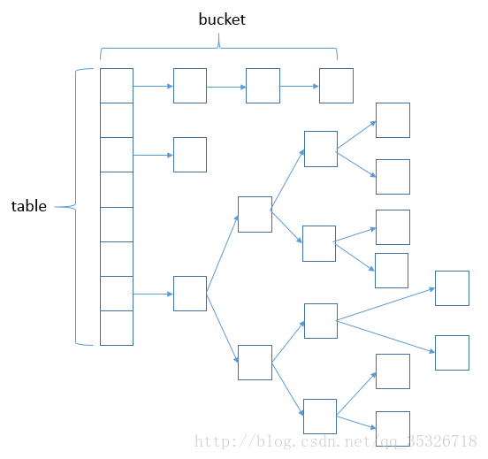
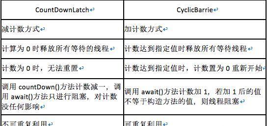
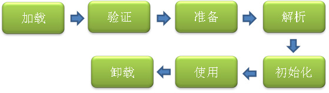

# 一、 Java 基础

#### 1、hashMap的实现原理和底层结构，hashMap，get方法的时间复杂度
https://www.cnblogs.com/yangming1996/p/7997468.html
 >- HashMap 是 Map 的一个实现类，它代表的是一种键值对的数据存储形式。Key 不允许重复出现，Value 随意。jdk 8 之前，其内部是由数组+链表来实现的，而 jdk 8 对于链表长度超过 8 的链表将转储为红黑树。大致的数据存储形式如下：
 
 
    //默认的容量，即默认的数组长度 16
    static final int DEFAULT_INITIAL_CAPACITY = 1 << 4;
    //最大的容量，即数组可定义的最大长度 
    static final int MAXIMUM_CAPACITY = 1 << 30;
    
  >有关 HashMap 的基本属性大致介绍如上。下面我们看看它的几个重载的构造函数。
  
    public HashMap(int initialCapacity, float loadFactor) {
        if (initialCapacity < 0)
            throw new IllegalArgumentException("Illegal initial capacity: " + initialCapacity);
        if (initialCapacity > MAXIMUM_CAPACITY)
            initialCapacity = MAXIMUM_CAPACITY;
        if (loadFactor <= 0 || Float.isNaN(loadFactor))
            throw new IllegalArgumentException("Illegal load factor: " +loadFactor);
        this.loadFactor = loadFactor;
        this.threshold = tableSizeFor(initialCapacity);
    }
  
 >这是一个最基本的构造函数，需要调用方传入两个参数，initialCapacity 和 loadFactor。程序的大部分代码在判断传入参数的合法性，initialCapacity 小于零将抛出异常，大于 MAXIMUM_CAPACITY 将被限定为 MAXIMUM_CAPACITY。loadFactor 如果小于等于零或者非数字类型也会抛出异常。
 
#### 2、解决key哈希值冲突的方法
- 开放定址法
    >当关键字key的哈希地址p=H（key）出现冲突时，以p为基础，产生另一个哈希地址p1，如果p1仍然冲突，再以p为基础，产生另一个哈希地址p2，…，直到找出一个不冲突的哈希地址pi ，将相应元素存入其中:
    1. 线性探测法ThreadLocalMap:如果发生冲突，算法会简单的从该槽位置向后循环遍历hash表，直到找到表中的下一个空槽，并将该元素放入该槽中（会导致相同hash值的元素挨在一起和其他hash值对应的槽被占用）。查找元素时，首先散列值所指向的槽，如果没有找到匹配，则继续从该槽遍历hash表，直到：（1）找到相应的元素；（2）找到一个空槽，指示查找的元素不存在，（所以不能随便删除元素）；（3）整个hash表遍历完毕（指示该元素不存在并且hash表是满的）
    2. 线性补偿探测法:即将上述算法中的线性探测的步长从 1 改为 Q ，在表的左右进行跳跃式探测，比较灵活。
 伪随机探测将线性探测的步长从常数改为随机数,这样就能使不同的关键字具有不同的探测次序，从而可以避免或减少堆聚
- 链地址法
    >将所有哈希地址为i的元素构成一个称为同义词链的单链表，并将单链表的头指针存在哈希表的第i个单元中，因而查找、插入和删除主要在同义词链中进行。链地址法适用于经常进行插入和删除的情况。（HashMap使用此法）
- 再哈希法
    >这种方法是同时构造多个不同的哈希函数，当发生哈希冲突时，就再计算一个哈希值，知道不冲突为止
- 建立公共溢出区
    >建立一个溢出区，凡是冲突的放到溢出区
#### 3、ArrayList与LinkedList的实现区别
#### 4、IO的几种模式（https://blog.csdn.net/woxinqidai/article/details/82717427）
        同步阻塞IO，同步非阻塞IO，IO多路复用，AIO(Asynchronous IO) 异步非阻塞IO
#### 5、说说反射机制的作用。
#### 6、反射机制会不会有性能问题？为什么
    
# 二、 Spring 基础

    1、spring事务的实现原理
    2、Spring框架中的单例bean是线程安全的吗?
    3、解释Spring框架中bean的生命周期。

# 三、 多线程

#### 1、volatile关键字的作用是什么
#### 2、Runnable接口和Callable接口的不同点？
#### 3、CyclicBarrier和CountDownLatch的区别
 
#### 4、volatile和synchronized的区别
   >- volatile本质是在告诉jvm当前变量在寄存器中的值是不确定的,需要从主存中读取,synchronized则是锁定当前变量,只有当前线程可以访问该变量,其他线程被阻塞住.
   >- volatile仅能使用在变量级别,synchronized则可以使用在变量,方法.
   >- volatile仅能实现变量的修改可见性,而synchronized则可以保证变量的修改可见性和原子性.
   >- volatile不会造成线程的阻塞,而synchronized可能会造成线程的阻塞.
#### 5、Lock和synchronized区别
    
#### 6、线程池ThreadPoolExecutor的工作原理
    （https://segmentfault.com/a/1190000012705130）
#### 7、新建T1、T2、T3三个线程，如何保证它们按顺序执行
#### 8、怎么中断一个线程？如何保证中断业务不影响？
#### 9、什么是重入锁？
#### 10、Fork/Join框架是干什么的？
#### 11、Jdk中排查多线程问题用什么命令？
#### 12、线程之间如何传递数据？
#### 13、FutureTask是什么？
#### 14、怎么唤醒一个阻塞的线程？
#### 15、什么是不可变对象，举例说明，在多线程有什么好处
       构造、测试和使用都很简单 
    　　线程安全且没有同步问题，不需要担心数据会被其它线程修改 
    　　当用作类的属性时不需要保护性拷贝 
    　　可以很好的用作Map键值和Set元素 
    　　不可变对象最大的缺点就是创建对象的开销，因为每一步操作都会产生一个新的对象。
#### 16、Java内存模型是什么，哪些区域是线程共享的，哪些是不共享的
#### 17、什么是乐观锁和悲观锁？
#### 18、什么是自旋锁？
#### 19、进程和线程的区别是什么？
    
#### 20、 如何确保N个线程可以访问N个资源同时又不导致死锁？
#### 21、 为什么wait，notify是对象的方法，而不是线程的方法
        
    
    

# 四、 jvm
    （http://www.importnew.com/23792.html）
    
    
#### 1、类加载机制
   >类从被加载到虚拟机内存中开始，到卸载出内存为止，它的整个生命周期包括：加载、验证、准备、解析、初始化、使用和卸载七个阶段。它们开始的顺序如下图所示：
   
   >其中类加载的过程包括了加载、验证、准备、解析、初始化五个阶段。在这五个阶段中，加载、验证、准备和初始化这四个阶段发生的顺序是确定的，而解析阶段则不一定，它在某些情况下可以在初始化阶段之后开始，这是为了支持 Java 语言的运行时绑定（也成为动态绑定或晚期绑定）。另外注意这里的几个阶段是按顺序开始，而不是按顺序进行或完成，因为这些阶段通常都是互相交叉地混合进行的，通常在一个阶段执行的过程中调用或激活另一个阶段。
   
   >这里简要说明下 Java 中的绑定：绑定指的是把一个方法的调用与方法所在的类(方法主体)关联起来，对 Java 来说，绑定分为静态绑定和动态绑定：
   - 静态绑定：即前期绑定。在程序执行前方法已经被绑定，此时由编译器或其它连接程序实现。针对 Java，简单的可以理解为程序编译期的绑定。Java 当中的方法只有 final，static，private 和构造方法是前期绑定的。
   - 动态绑定：即晚期绑定，也叫运行时绑定。在运行时根据具体对象的类型进行绑定。在 Java 中，几乎所有的方法都是后期绑定的。
   ##

#### 2、Java 内存区域与内存溢出
#####内存区域
   > Java 虚拟机在执行 Java 程序的过程中会把他所管理的内存划分为若干个不同的数据区域。Java 虚拟机规范将 JVM 所管理的内存分为以下几个运行时数据区：程序计数器、Java 虚拟机栈、本地方法栈、Java 堆、方法区。下面详细阐述各数据区所存储的数据类型。
    
#####程序计数器
   > 一块较小的内存空间，它是当前线程所执行的字节码的行号指示器，字节码解释器工作时通过改变该计数器的值来选择下一条需要执行的字节码指令，分支、跳转、循环等基础功能都要依赖它来实现。每条线程都有一个独立的的程序计数器，各线程间的计数器互不影响，因此该区域是线程私有的。
   
   > 当线程在执行一个 Java 方法时，该计数器记录的是正在执行的虚拟机字节码指令的地址，当线程在执行的是 Native 方法（调用本地操作系统方法）时，该计数器的值为空。另外，该内存区域是唯一一个在 Java 虚拟机规范中么有规定任何 OOM（内存溢出：OutOfMemoryError）情况的区域。
     
#####Java 虚拟机栈
   >该区域也是线程私有的，它的生命周期也与线程相同。虚拟机栈描述的是 Java 方法执行的内存模型：每个方法被执行的时候都会同时创建一个栈帧，栈它是用于支持续虚拟机进行方法调用和方法执行的数据结构。对于执行引擎来讲，活动线程中，只有栈顶的栈帧是有效的，称为当前栈帧，这个栈帧所关联的方法称为当前方法，执行引擎所运行的所有字节码指令都只针对当前栈帧进行操作。栈帧用于存储局部变量表、操作数栈、动态链接、方法返回地址和一些额外的附加信息。在编译程序代码时，栈帧中需要多大的局部变量表、多深的操作数栈都已经完全确定了，并且写入了方法表的 Code 属性之中。因此，一个栈帧需要分配多少内存，不会受到程序运行期变量数据的影响，而仅仅取决于具体的虚拟机实现。
    
   >在 Java 虚拟机规范中，对这个区域规定了两种异常情况：
- 如果线程请求的栈深度大于虚拟机所允许的深度，将抛出StackOverflowError异常。
- 如果虚拟机在动态扩展栈时无法申请到足够的内存空间，则抛出OutOfMemoryError异常。

1、局部变量表
>局部变量表是一组变量值存储空间，用于存放方法参数和方法内部定义的局部变量，其中存放的数据的类型是编译期可知的各种基本数据类型、对象引用（reference）和 returnAddress 类型（它指向了一条字节码指令的地址）。局部变量表所需的内存空间在编译期间完成分配，即在 Java 程序被编译成 Class 文件时，就确定了所需分配的最大局部变量表的容量。当进入一个方法时，这个方法需要在栈中分配多大的局部变量空间是完全确定的，在方法运行期间不会改变局部变量表的大小。
 
>局部变量表的容量以变量槽（Slot）为最小单位。在虚拟机规范中并没有明确指明一个 Slot 应占用的内存空间大小（允许其随着处理器、操作系统或虚拟机的不同而发生变化），一个 Slot 可以存放一个32位以内的数据类型：boolean、byte、char、short、int、float、reference 和 returnAddresss。reference 是对象的引用类型，returnAddress 是为字节指令服务的，它执行了一条字节码指令的地址。对于 64 位的数据类型（long和double），虚拟机会以高位在前的方式为其分配两个连续的 Slot 空间。
 
>虚拟机通过索引定位的方式使用局部变量表，索引值的范围是从 0 开始到局部变量表最大的 Slot 数量，对于 32 位数据类型的变量，索引 n 代表第 n 个 Slot，对于 64 位的，索引 n 代表第 n 和第 n+1 两个 Slot。
 
>在方法执行时，虚拟机是使用局部变量表来完成参数值到参数变量列表的传递过程的，如果是实例方法（非static），则局部变量表中的第 0 位索引的 Slot 默认是用于传递方法所属对象实例的引用，在方法中可以通过关键字“this”来访问这个隐含的参数。其余参数则按照参数表的顺序来排列，占用从1开始的局部变量 Slot，参数表分配完毕后，再根据方法体内部定义的变量顺序和作用域分配其余的 Slot。
 
>局部变量表中的 Slot 是可重用的，方法体中定义的变量，作用域并不一定会覆盖整个方法体，如果当前字节码PC计数器的值已经超过了某个变量的作用域，那么这个变量对应的 Slot 就可以交给其他变量使用。这样的设计不仅仅是为了节省空间，在某些情况下 Slot 的复用会直接影响到系统的而垃圾收集行为。
2、操作数栈

>操作数栈又常被称为操作栈，操作数栈的最大深度也是在编译的时候就确定了。32 位数据类型所占的栈容量为 1,64 位数据类型所占的栈容量为 2。当一个方法开始执行时，它的操作栈是空的，在方法的执行过程中，会有各种字节码指令（比如：加操作、赋值元算等）向操作栈中写入和提取内容，也就是入栈和出栈操作。

>Java 虚拟机的解释执行引擎称为“基于栈的执行引擎”，其中所指的“栈”就是操作数栈。因此我们也称 Java 虚拟机是基于栈的，这点不同于 Android 虚拟机，Android 虚拟机是基于寄存器的。

>基于栈的指令集最主要的优点是可移植性强，主要的缺点是执行速度相对会慢些；而由于寄存器由硬件直接提供，所以基于寄存器指令集最主要的优点是执行速度快，主要的缺点是可移植性差。

3、动态连接

>每个栈帧都包含一个指向运行时常量池（在方法区中，后面介绍）中该栈帧所属方法的引用，持有这个引用是为了支持方法调用过程中的动态连接。Class 文件的常量池中存在有大量的符号引用，字节码中的方法调用指令就以常量池中指向方法的符号引用为参数。这些符号引用，一部分会在类加载阶段或第一次使用的时候转化为直接引用（如 final、static 域等），称为静态解析，另一部分将在每一次的运行期间转化为直接引用，这部分称为动态连接。

4、方法返回地址

>当一个方法被执行后，有两种方式退出该方法：执行引擎遇到了任意一个方法返回的字节码指令或遇到了异常，并且该异常没有在方法体内得到处理。无论采用何种退出方式，在方法退出之后，都需要返回到方法被调用的位置，程序才能继续执行。方法返回时可能需要在栈帧中保存一些信息，用来帮助恢复它的上层方法的执行状态。一般来说，方法正常退出时，调用者的 PC 计数器的值就可以作为返回地址，栈帧中很可能保存了这个计数器值，而方法异常退出时，返回地址是要通过异常处理器来确定的，栈帧中一般不会保存这部分信息。

>方法退出的过程实际上等同于把当前栈帧出站，因此退出时可能执行的操作有：恢复上层方法的局部变量表和操作数栈，如果有返回值，则把它压入调用者栈帧的操作数栈中，调整 PC 计数器的值以指向方法调用指令后面的一条指令。

#####本地方法栈
>该区域与虚拟机栈所发挥的作用非常相似，只是虚拟机栈为虚拟机执行 Java 方法服务，而本地方法栈则为使用到的本地操作系统（Native）方法服务。
#####Java 堆
>Java Heap 是 Java 虚拟机所管理的内存中最大的一块，它是所有线程共享的一块内存区域。几乎所有的对象实例和数组都在这类分配内存。Java Heap 是垃圾收集器管理的主要区域，因此很多时候也被称为“GC堆”。
 
>根据 Java 虚拟机规范的规定，Java 堆可以处在物理上不连续的内存空间中，只要逻辑上是连续的即可。如果在堆中没有内存可分配时，并且堆也无法扩展时，将会抛出 OutOfMemoryError 异常。
#####方法区
>方法区也是各个线程共享的内存区域，它用于存储已经被虚拟机加载的类信息、常量、静态变量、即时编译器编译后的代码等数据。方法区域又被称为“永久代”，但这仅仅对于 Sun HotSpot 来讲，JRockit 和 IBM J9 虚拟机中并不存在永久代的概念。Java 虚拟机规范把方法区描述为 Java 堆的一个逻辑部分，而且它和 Java Heap 一样不需要连续的内存，可以选择固定大小或可扩展，另外，虚拟机规范允许该区域可以选择不实现垃圾回收。相对而言，垃圾收集行为在这个区域比较少出现。该区域的内存回收目标主要针是对废弃常量的和无用类的回收。运行时常量池是方法区的一部分，Class 文件中除了有类的版本、字段、方法、接口等描述信息外，还有一项信息是常量池（Class文件常量池），用于存放编译器生成的各种字面量和符号引用，这部分内容将在类加载后存放到方法区的运行时常量池中。运行时常量池相对于 Class 文件常量池的另一个重要特征是具备动态性，Java 语言并不要求常量一定只能在编译期产生，也就是并非预置入 Class 文件中的常量池的内容才能进入方法区的运行时常量池，运行期间也可能将新的常量放入池中，这种特性被开发人员利用比较多的是 String 类的 intern（）方法。

>根据 Java 虚拟机规范的规定，当方法区无法满足内存分配需求时，将抛出 OutOfMemoryError 异常。
#####直接内存
>直接内存并不是虚拟机运行时数据区的一部分，也不是 Java 虚拟机规范中定义的内存区域，它直接从操作系统中分配，因此不受 Java 堆大小的限制，但是会受到本机总内存的大小及处理器寻址空间的限制，因此它也可能导致 OutOfMemoryError 异常出现。在 JDK1.4 中新引入了 NIO 机制，它是一种基于通道与缓冲区的新 I/O 方式，可以直接从操作系统中分配直接内存，即在堆外分配内存，这样能在一些场景中提高性能，因为避免了在 Java 堆和 Native 堆中来回复制数据。

###Java 垃圾收集机制

####对象引用

##### &emsp;&emsp;&emsp;&emsp;&emsp;&emsp; Java 中的垃圾回收一般是在 Java 堆中进行，因为堆中几乎存放了 Java 中所有的对象实例。谈到 Java 堆中的垃圾回收，自然要谈到引用。在 JDK1.2 之前，Java 中的引用定义很很纯粹：如果 reference 类型的数据中存储的数值代表的是另外一块内存的起始地址，就称这块内存代表着一个引用。但在 JDK1.2 之后，Java 对引用的概念进行了扩充，将其分为强引用（Strong Reference）、软引用（Soft Reference）、弱引用（Weak Reference）、虚引用（Phantom Reference）四种，引用强度依次减弱。
- 强引用：如“Object obj = new Object（）”，这类引用是 Java 程序中最普遍的。只要强引用还存在，垃圾收集器就永远不会回收掉被引用的对象。
- 软引用：它用来描述一些可能还有用，但并非必须的对象。在系统内存不够用时，这类引用关联的对象将被垃圾收集器回收。JDK1.2 之后提供了 SoftReference 类来实现软引用。
- 弱引用：它也是用来描述非需对象的，但它的强度比软引用更弱些，被弱引用关联的对象只能生存岛下一次垃圾收集发生之前。当垃圾收集器工作时，无论当前内存是否足够，都会回收掉只被弱引用关联的对象。在 JDK1.2 之后，提供了 WeakReference 类来实现弱引用。
- 虚引用：最弱的一种引用关系，完全不会对其生存时间构成影响，也无法通过虚引用来取得一个对象实例。为一个对象设置虚引用关联的唯一目的是希望能在这个对象被收集器回收时收到一个系统通知。JDK1.2 之后提供了 PhantomReference 类来实现虚引用。
    1、类加载机制，步骤，各做了什么事情
        （http://www.importnew.com/23742.html）
        
    2、jvm内存结构
         （http://www.importnew.com/23746.html）
        对象分配规则
        对象优先分配在Eden区，如果Eden区没有足够的空间时，虚拟机执行一次Minor GC。
        大对象直接进入老年代（大对象是指需要大量连续内存空间的对象）。这样做的目的是避免在Eden区和两个Survivor区之间发生大量的内存拷贝（新生代采用复制算法收集内存）。
        长期存活的对象进入老年代。虚拟机为每个对象定义了一个年龄计数器，如果对象经过了1次Minor GC那么对象会进入Survivor区，之后每经过一次Minor GC那么对象的年龄加1，知道达到阀值对象进入老年区。
        动态判断对象的年龄。如果Survivor区中相同年龄的所有对象大小的总和大于Survivor空间的一半，年龄大于或等于该年龄的对象可以直接进入老年代。
        空间分配担保。每次进行Minor GC时，JVM会计算Survivor区移至老年区的对象的平均大小，如果这个值大于老年区的剩余值大小则进行一次Full GC，如果小于检查HandlePromotionFailure设置，如果true则只进行Monitor GC,如果false则进行Full GC。
        
    3、GC算法 垃圾回收（http://www.importnew.com/23752.html）
    
        标记 -清除算法，“标记-清除”（Mark-Sweep）算法，如它的名字一样，算法分为“标记”和“清除”两个阶段：首先标记出所有需要回收的对象，在标记完成后统一回收掉所有被标记的对象。
        复制算法，“复制”（Copying）的收集算法，它将可用内存按容量划分为大小相等的两块，每次只使用其中的一块。当这一块的内存用完了，就将还存活着的对象复制到另外一块上面，然后再把已使用过的内存空间一次清理掉。
        标记-压缩算法，标记过程仍然与“标记-清除”算法一样，但后续步骤不是直接对可回收对象进行清理，而是让所有存活的对象都向一端移动，然后直接清理掉端边界以外的内存
        分代收集算法，“分代收集”（Generational Collection）算法，把Java堆分为新生代和老年代，这样就可以根据各个年代的特点采用最适当的收集算法。
        
        垃圾收集器
        
        
    4、GC分析 命令调优
        http://www.importnew.com/23761.html
        
    5、什么情况产生年轻代内存溢出、什么情况产生年老代内存溢出
    6、如何选择合适的垃圾收集算法？
    7、JVM中最大堆大小有没有限制？
    8、吞吐量优先选择什么垃圾回收器？响应时间优先呢？
    9、如何进行JVM调优？有哪些方法？
    10、如何理解内存泄漏问题？有哪些情况会导致内存泄露？如何解决？
    11、JDK和JRE的区别是什么？
        Java运行时环境(JRE)是将要执行Java程序的Java虚拟机。它同时也包含了执行applet需要的浏览器插件。Java开发工具包(JDK)是完整的Java软件开发包，包含了JRE，编译器和其他的工具(比如：JavaDoc，Java调试器)，可以让开发者开发、编译、执行Java应用程序。
    

# 五、 算法

    1、使用代码写出快速排序
    2、使用代码写出堆排序
    3、倒排索引的原理
    4、谈一谈一致性哈希算法。

# 六、 分布式架构

    1、微服务如何实现幂等性
    2、分布式事务的实现方式有哪几种
    

# 七、 消息队列
### 1、activeMQ

### 2、rabiitMQ

### 3、kafka

# 八、 关系型数据库

### 1、 mysql
    
#### 1、mysql如何实现主从备份的
#### 2、Mysql中的myisam与innodb的区别

 >- InooDB支持事务，而MyISAM不支持事务
 >- InnoDB支持行级锁，而MyISAM支持表级锁
 >- InnoDB支持MVCC，而MyISAM不支持
 >- InnoDB支持外键，而MyISAM不支持
 >- InnoDB不支持全文索引，而MyISAM支持
        
#### 3、InooDB和MyISAM的select count（*）哪个更快，为什么
        
   >myisam更快，因为myisam内部维护了一个计算器，可以直接调取。MyISAM的索引和数据是分开的，并且索引是有压缩的，内存使用率就对应提高了不少。能加载更多索引，而Innodb是索引和数据是紧密捆绑的，没有使用压缩从而会造成Innodb比MyISAM体积庞大不小。

#### 4、事务的4种隔离级别
        1）读未提交（read uncommitted）
        2）读已提交 (read committed)
        3）可重复读 (repeatable read)
        4）可串行化 (Serializable)
#### 5、一张表里面有ID自增主键，当insert了17条记录之后，删除了第15,16,17条记录，再把mysql重启，再insert一条记录，这条记录的ID是18还是15 ？
   >- 如果类型是myisam，那么是18，MyISAM会把自增最大ID记录到数据文件里，重启最大id不会丢失
   >- 如果是innodb 那么是15，MyISAM会把自增最大ID记录到内存中，重启数据库或者OPTIMIZE操作都会导致最大ID丢失
#### 6、为什么使用数据索引能提高效率
        1）数据索引的存储是有序的
        2）在有序的情况下，通过索引查询一个数据是无需遍历索引记录的
        3）极端情况下，数据索引的查询效率为二分法查询效率，趋近于 log2(N)
    7、B+树索引和哈希索引的区别（https://blog.csdn.net/weixin_42688876/article/details/81480311）
        B+树是一个平衡的多叉树，从根节点到每个叶子节点的高度差值不超过1，而且叶子节点的指针相互链接，是有序的
        哈希索引就是采用一定的哈希算法，把键值换算成新的哈希值，检索时不需要类似B+树那样从跟节点到叶子节点逐级查找，只需要 一次哈希算法即可，是无序的
        
    8、B树和B+树的区别（https://blog.csdn.net/weixin_42688876/article/details/81480311）
        B树，每个节点都存储key和data，所有的节点组成这可树，并且叶子节点指针为null，叶子节点不包含任何关键字信息
        B+树，所有的叶子节点中包含全部关键字的信息，及指向含有这些关键字记录的指针，且叶子节点本身依关键字的大小自小到大的顺序链接，所有的非终端节点可以看成是索引部分，节点中仅含有其子树根节点中最大（或最小）关键字
    
    9、什么情况下应不建或少建索引
        表记录太少
        经常插入、删除、修改的表
        数据重复且分布平均的表字段，假如一个表有10万行记录，有一个字段A只有T和F两种值，且每个值的分布概率大约为50%，那么对这种表A字段建索引一般不会提高数据库的查询速度。
        经常和主字段一块查询但主字段索引值比较多的表字段
    10、表分区有什么好处？
        分区表的数据可以分布在不同的物理设备上，从而高效地利用多个硬件设备。 2. 和单个磁盘或者文件系统相比，可以存储更多数据
        优化查询。在where语句中包含分区条件时，可以只扫描一个或多个分区表来提高查询效率；涉及sum和count语句时，也可以在多个分区上并行处理，最后汇总结果。
        分区表更容易维护。例如：想批量删除大量数据可以清除整个分区。
        可与使用分区表来避免某些特殊的瓶颈，例如InnoDB的单个索引的互斥访问，ext3问价你系统的inode锁竞争等。
    11、分区表的限制因素
        1）、一个表最多只能有1024个分区
        2）、MySQL5.1中，分区表达式必须是整数，或者返回整数的表达式。在MySQL5.5中提供了非整数表达式分区的支持。
        3）、如果分区字段中有主键或者唯一索引的列，那么多有主键列和唯一索引列都必须包含进来。即：分区字段要么不包含主键或者索引列，要么包含全部主键和索引列。
        4）、分区表中无法使用外键约束
        5）、MySQL的分区适用于一个表的所有数据和索引，不能只对表数据分区而不对索引分区，也不能只对索引分区而不对表分区，也不能只对表的一部分数据分区。
    12、Mysql支持的分区类型有哪些？
        1）、RANGE分区：这种模式允许将数据划分不同范围。例如可以将一个表通过年份划分成若干个分区
        2）、List分区：这种模式允许系统通过预定义的列表的值来对数据进行分割。按照list中的值分区，与RANGE的区别是，range分区的区间范围值是连续的
        3）、HASH分区：这种模式允许通过对表的一个或多个列的Hash Key进行计算，最后通过这个Hash码不同数值对应的数据区域进行分区。例如可以建立一个对表主键进行分区的表
        4）、KEY分区：上面Hash模式的一种延伸，这里的Hash Key是Mysql系统产生的
    13、mysql的优化
        1）、开启查询缓存，优化查询
        2）、explain你的select查询，这可以帮你分析你的查询语句或是表结构的性能瓶颈。EXPLAIN的查询结果还会告诉你你的索引主键被如何利用的，你的数据表是如何被搜索和排序
        3）、当只要一行数据时使用limit 1，Mysql数据库引擎会在找到一条数据后停止搜索，而不是继续往后查找下一条符合记录的数据
        4）、为搜索字段建索引
        5）、使用ENUM而不是VARCHAR，如果你有一个字段，比如“性别”，“国家”，“民族”，“状态”或“部门”，你知道这些字段的取值是有限而且固定的，那么，你应该使用ENUM而不是VARCHAR
        6）、Prepared Statement Prepared Statements很像存储过程，是一种运行在后台的sql语句集合，我们可以从使用prepared statement获得很多好处，无论是性能问题还是安全问题。Prepared Statements可以检查一些你绑定好的变量，这样可以保护你的程序不会受到“SQL注入式”攻击
        7）、垂直分表
        8）、选择正确的存储引擎
    14、key和index的区别
        1）、key是数据库的物理结构，它包含两层意义和作用，一是约束（偏重于约束和规范数据库的结构完整性），二是索引（辅助查询用的）。包括primary key，unique key，foregin key等
        2）、index是数据库的物理结构，它只是辅助查询的，它创建时会在另外的表空间（mysql中的innodb表空间）以一个类似目录的结构存储。索引要分类的话，分为前缀索引、全文本索引等

# 九、 非关系型数据库

## redis 
    
    1、redis内存回收策略：
        （https://www.cnblogs.com/WJ5888/p/4371647.html）
      noeviction:返回错误当内存限制达到并且客户端尝试执行会让更多内存被使用的命令（大部分的写入指令，但DEL和几个例外）
      allkeys-lru: 尝试回收最少使用的键（LRU），使得新添加的数据有空间存放。
      volatile-lru: 尝试回收最少使用的键（LRU），但仅限于在过期集合的键,使得新添加的数据有空间存放。
      allkeys-random: 回收随机的键使得新添加的数据有空间存放。
      volatile-random: 回收随机的键使得新添加的数据有空间存放，但仅限于在过期集合的键。
      volatile-ttl: 回收在过期集合的键，并且优先回收存活时间（TTL）较短的键,使得新添加的数据有空间存放。
      
    2、redis键值最大的容量是多少？
    3、redis分片原理
    4、redis哈希剿的概念
    5、redis如何做内存优化
    6、redis插入大量数据的方法
        http://www.redis.cn/topics/mass-insert.html
    7、redis如何做横向扩容
    8、redis如何实现分布式锁，如何实现先到先得
    9、redis持久化的方式，各有什么优缺点
    10、海量日志如何排序和处理
    11、redis的key是如何寻址的
    
# 十、 笔试题
    
    
      

